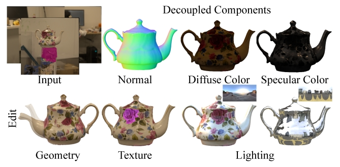

# DeferredGS: Decoupled and Relightable Gaussian Splatting with Deferred Shading
This repository contains the implementation with pytorch for paper "DeferredGS: Decoupled and Relightable Gaussian Splatting with Deferred Shading".



## Set-up

### Conda
```
conda create -n pytorchdefergs python=3.10
conda activate pytorchdefergs
pip install torch==1.13.1+cu117 torchvision==0.14.1+cu117 torchaudio==0.13.1 --extra-index-url https://download.pytorch.org/whl/cu117
pip install -r requirements.txt
git clone https://github.com/NVlabs/nvdiffrast
cd nvdiffrast
python setup.py install

```
### Compile the submodules

The simple-knn ,diff_surfel_rasterization modules should be compiled with cmake and make:

```
cd submodules/diff_surfel_rasterization
python setup.py install
cd ../simple_knn
python setup.py install
```


## Get Starting

### 1.Dataset Preparation 

- RefNerf Dataset is supported,and other dataset needs to be modified in "scene/dataset_readers.py"(readCamerasFromTransforms to change the image/normal/alpha name):

  - The dafault version is 2DGS, we use it to guide normal optimization.
  - (Optional)you can modified the "surf_normal"(Line 101 in "train.py") to the normal image from other surface reconstruction methods.

### 2.Training
The same as 3DGS
```python
CUDA_VISIBLE_DEVICES=1 python train.py -s /data/refnerf/car -m output/car
```

### 3.Rendering & Evaluation
We have prepared some envmaps in "envmap"
```python
# multi-view rendering 
python render.py -s /data/refnerf/car -m output/car
# multi-view relighting 
python render.py -s /data/refnerf/car -m output/car --novel_brdf_envmap /data1/wutong/sig24/20230420_code/GaussianShader/data/envmap/sunset.exr
# evaluation
python metrics.py -m output/car
```


## Acknowledgements

The original implementation comes from the following cool project:

* [3DGS](https://github.com/graphdeco-inria/gaussian-splatting/)
* [2DGS](https://github.com/hbb1/2d-gaussian-splatting/)
* [nvidiffrast](https://github.com/NVlabs/nvdiffrast)